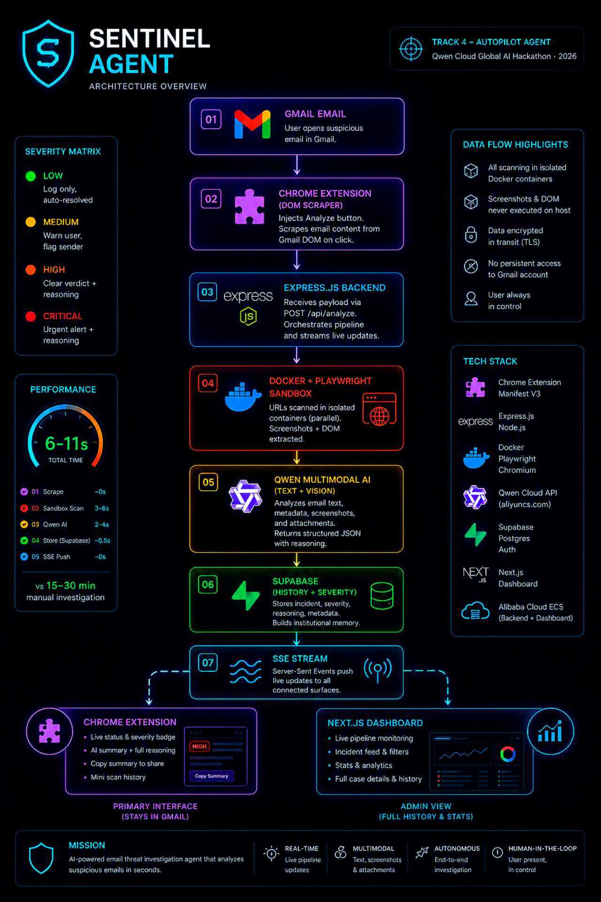
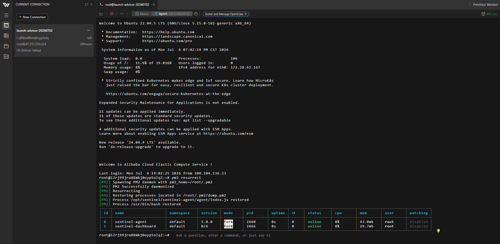
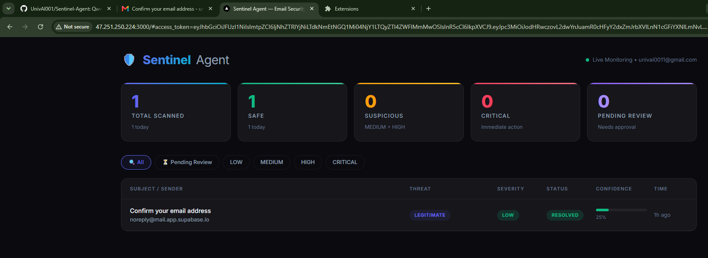
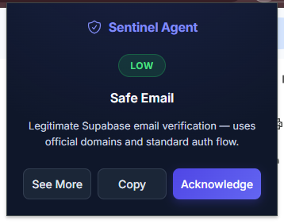

# Sentinel Agent

Sentinel is a production-ready, autonomous AI-powered email security agent that detects and investigates phishing threats in real time. Built for the **Qwen Cloud Global AI Hackathon (Track 4: Autopilot Agent)**, it combines Qwen's multimodal reasoning with a stealth sandboxed scanning pipeline — delivering a verdict in seconds, not hours.

> 🌐 **Live Dashboard:** [http://47.251.250.224:3000](http://47.251.250.224:3000)  
> ☁️ **Backend deployed and running on Alibaba Cloud ECS.**

---

## Demo

▶️ [Watch Demo Video](https://youtu.be/Pls6PKMTbrQ?si=1knCETDp42u5BJES)



---

## Alibaba Cloud Integration

This project uses the Qwen Cloud API running on Alibaba Cloud infrastructure.

**Base URL:** `https://dashscope-intl.aliyuncs.com/compatible-mode/v1`

See: [`sentinel-agent/lib/qwen.js`](./sentinel-agent/lib/qwen.js)

The backend and dashboard are deployed on **Alibaba Cloud ECS** (US Silicon Valley region).





---

## How It Works

When a user opens an email in Gmail, the Sentinel extension automatically detects the open inbox and surfaces an Analyze button. One click starts the full autonomous pipeline:

```
INGEST → SANDBOX SCAN → QWEN ANALYSIS → SEVERITY DECISION → VERDICT
```

1. **Chrome Extension** scrapes email content directly from the Gmail DOM — sender, subject, body, links, and attachments. No Gmail OAuth or inbox access required.
2. **Express Backend** on Alibaba Cloud ECS receives the payload and orchestrates the pipeline.
3. **Docker + Playwright Sandbox** loads any suspicious URLs inside isolated containers. Screenshots and DOM content are captured safely, then the container is destroyed.
4. **Qwen Multimodal AI** receives the full context — email text, screenshots, attachments — in a single API call and reasons through the threat, returning a structured verdict with severity and detailed explanation.
5. **Supabase** stores the incident record — verdict, reasoning, severity, metadata — building institutional memory across scans.
6. **Server-Sent Events (SSE)** push the live verdict simultaneously to the Chrome extension and the Next.js dashboard.

---

## Installation & Setup

> ✅ The backend is already live on Alibaba Cloud. You only need to install the extension and create an account.

### 1. Clone the Repository

```bash
git clone https://github.com/UnivAI001/Sentinel-Agent.git
```

### 2. Load the Extension into Chrome

> ⚠️ Select only the `sentinel-extension` folder — not the root directory.

1. Open Chrome and navigate to `chrome://extensions`
2. Enable **Developer Mode** (top right toggle)
3. Click **Load unpacked**
4. Select the `sentinel-extension` folder from the cloned repo


### 3. Create an Account

- Visit the live dashboard: [http://47.251.250.224:3000](http://47.251.250.224:3000)
- Click **Sign Up** and create an account
- Check your email for a Supabase confirmation link and confirm it

### 4. Log Into the Extension

- Click the Sentinel icon in your Chrome toolbar
- Sign in with the same credentials used on the dashboard
- You are ready

### 5. Analyze an Email

- Open any email in Gmail
- Sentinel automatically detects the open inbox and shows the **Analyze** button
- Click it — the agent handles everything from here
- Watch the live status update in the extension popup
- Receive your verdict: severity badge, AI summary, and full Qwen reasoning on request



---

## Two Surfaces, One Agent

> The dashboard is not required for Sentinel to work. The Chrome extension operates fully autonomously inside Gmail. The dashboard exists for users who want full scan history, case details, and stats.

| Surface | Purpose |
|---|---|
| Chrome Extension | Primary interface — stays in Gmail, shows live scan status and verdict |
| Next.js Dashboard | Admin view — full incident history, stats, detailed Qwen reasoning, audit trail |

---

## Severity Matrix

| Level | Response |
|---|---|
| 🟢 LOW | Logged silently, auto-resolved |
| 🟡 MEDIUM | User warned in extension, sender flagged |
| 🟠 HIGH | Clear verdict shown, full Qwen reasoning visible |
| 🔴 CRITICAL | Urgent verdict shown, full reasoning, copy to share |

---

## Environment Variables

To run locally, create a `.env` file inside `sentinel-agent/`:

```env
QWEN_API_KEY=your_qwen_api_key
QWEN_BASE_URL=https://dashscope-intl.aliyuncs.com/compatible-mode/v1
SUPABASE_URL=your_supabase_url
SUPABASE_SERVICE_KEY=your_supabase_service_key
```

---

## Tech Stack

| Layer | Technology |
|---|---|
| AI Reasoning + Vision | Qwen Cloud API (Alibaba Cloud) |
| Sandboxed Scanning | Docker + Playwright (Headless Chromium, Stealth Config) |
| Backend | Node.js + Express.js |
| Live Updates | Server-Sent Events (SSE) |
| Database + Auth | Supabase (Postgres) |
| Frontend Dashboard | Next.js |
| Browser Extension | Chrome Extension (Manifest V3) |
| Deployment | Alibaba Cloud ECS |

---

## Repository Structure

```
sentinel-agent/       # Express backend + pipeline
sentinel-extension/   # Chrome extension (load this as unpacked)
dashboard/            # Next.js dashboard
screenshots/          # Submission screenshots
2578.jpg              # Architecture diagram
README.md
LICENSE
```

---

## License

MIT License — see [LICENSE](./LICENSE)
